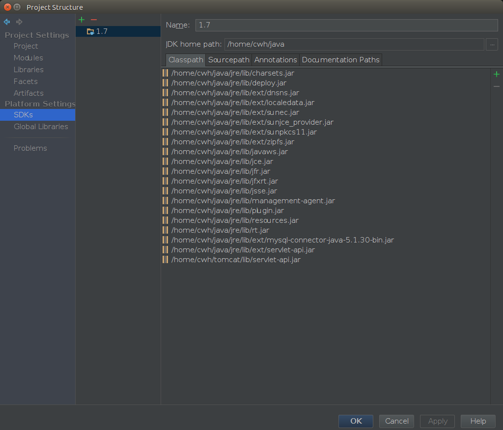

###**IDEA servlet-api.jar**(2015-1-6)

   idea从14升级到15后，发现
```java
import javax.servlet.AsyncContext;
```

找不到，
右击工程，open module setting，找到图中的位置，在classPath里添加tomcat的servlet-api.jar即可。



###**tomcat允许跨域**(2016-1-12)

参考 ： https://tomcat.apache.org/tomcat-7.0-doc/config/filter.html

1. 全局方式

在/tomcat/conf/web.xml中，添加这样一个filter

```xml
<filter>
<filter-name>CorsFilter</filter-name>
<filter-class>org.apache.catalina.filters.CorsFilter</filter-class>
<async-supported>true</async-supported>
</filter>
<filter-mapping>
<filter-name>CorsFilter</filter-name>
<url-pattern>/*</url-pattern>
</filter-mapping>
```
其中async-supported不是必须的，如果你用到了AsyncContext，这里又是全局的filter，就需要设置允许async。

全局方式对虚拟目录也能生效。

2.非全局方式

在web app的web.xml里加上面这个filter就好了，记得要把url-pattern这一项改成对应的格式。

### tomcat虚拟目录
最简单的非侵入式的方式是：在tomcat/conf/Catalina/localhost目录下添加一个xml文件，内容如下：
```xml
<?xml version="1.0" encoding="UTF-8"?>
<Context  reloadable="true" docBase="/home/cwh/Software/learn_software" crossContext="true">
</Context>
```
其中，
- reloadable表示在启动tomcat后，目录内容改变时，是否允许不重启tomcat，仅刷新就得到新的内容，可以则为true
- docBase即虚拟目录代表的本地目录
- crossContext表示是否允许跨域，

然后把xml命名成虚拟目录名，比如test，则可以通过url：http://localhost:8888/test访问docBase下的文件
