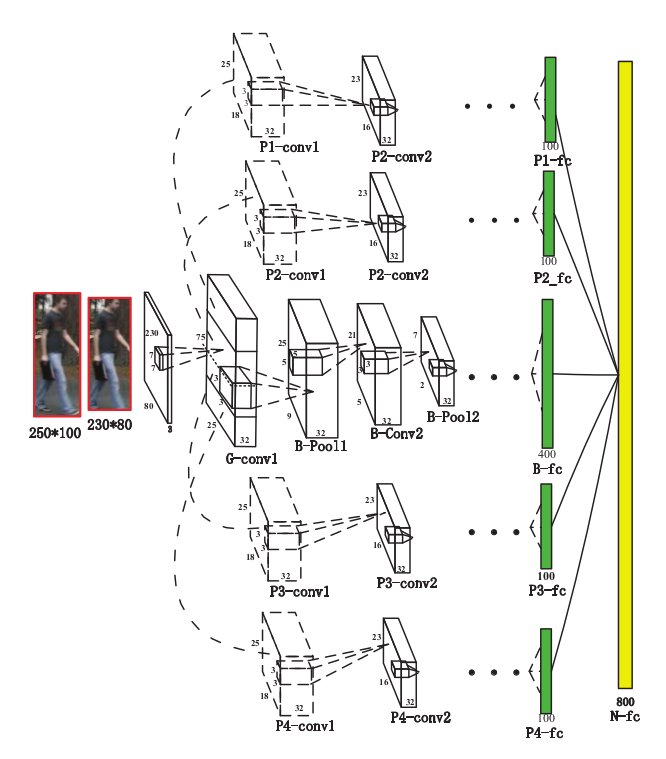
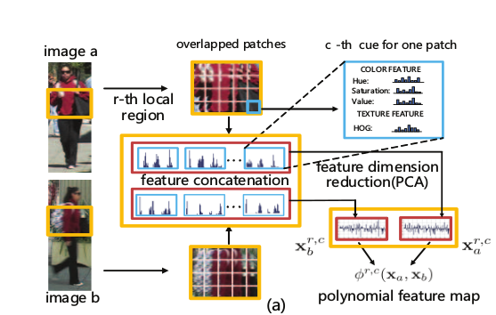
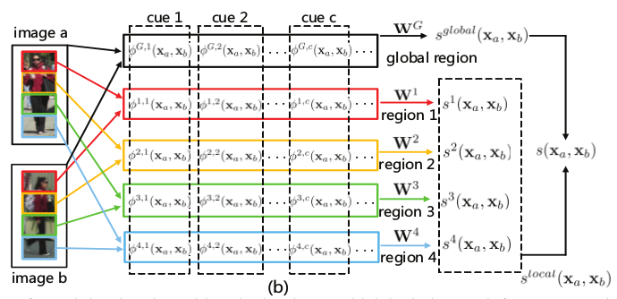
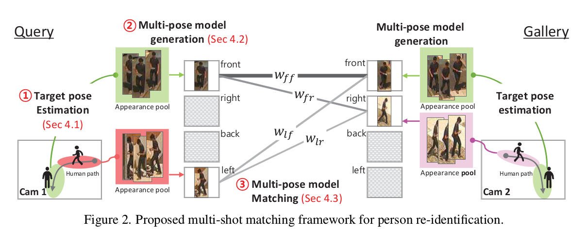
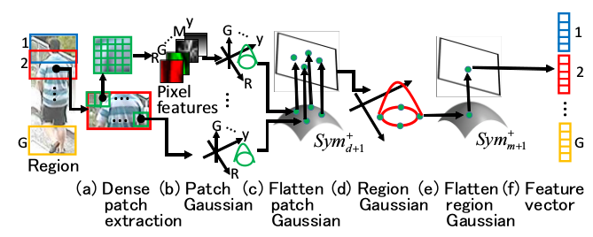
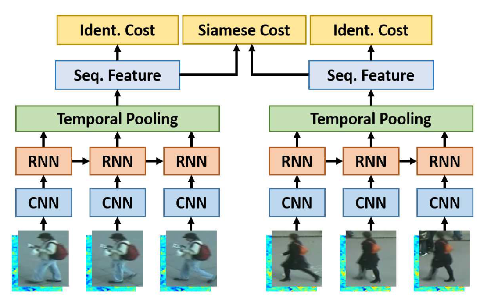
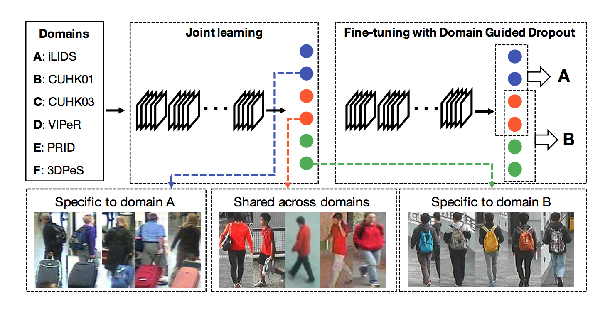

# CVPR2016中的Re-id
## Part-based-CNN
- DataSet: i-LIDS, PRID2011, VIPeR and CUHK01
- 同时调整特征提取和距离测量公式的参数
- 提取身体部分的特征和全身特征作为一个特征

- 使用[triplet loss](http://blog.csdn.net/tangwei2014/article/details/46788025)，同时缩小类内差异，增大类间差异

## Spatial Constraints

- 提取身体部分特征和全身特征共同计算相似度

- dataset:VIPeR, GRID, 3DPES, Market-1501

## Pose-aware

- 根据移动路径判断姿态，对其他姿态图像做推断，并用推断结果做match
- CUHK02 [12] and VIPeR [8], iLIDS-Vid [19], PRID 2011 [9] and 3DPeS [3]

## Hierarchical Gaussian Descriptor

- 对图片做切片，找一个能描述切片像素数据分布的高斯分布
- 逐级整合各个切片的高斯分布

- VIPeR [12], CUHK01 [20], GRID [26], PRID450S [33] and CUHK03 [21].

## RNN-CNN

- 两组图片，分别通过CNN+RNN得到特征
- 特征分别用identity目标做优化，用recognize目标做优化
-  iLIDS-VID and PRID-2011

## Cross-Dataset Transfer Learning
- 用一个有标签数据集训练特征表达模型，分解出数据集共用的模式和数据集独有的模式
- 将模型应用在无标签无监督聚类上
- VIPeR PRID CUHK01 CAVIAR iLIDS

## domain-based-cnn

- 先将所有数据集混合在一起，训练CNN做分类
- 逐个去掉神经元，观察在不同数据集中损失函数的变化，变化少的说明这个神经元对这个domain没用
- 对每个神经元，根据神经元对loss的影响，设置一个因数据集不同而不同的dropout值
- 实现对不同数据集有不同的预测能力
- CUHK03，CUHK01，PRID，VIPeR (I cannot find the link to the original dataset. This is my previous backup version.)，3DPeS，i-LIDS (I cannot find the link to the original dataset. This is my previous backup version.)，Shinpuhkan (need to send an email to the authors)

## Video-Based-Top-Push-Multi-shot
- 多匹配
- 按匹配程度排序，避免因顺序或者帧刚好错开导致的低效匹配和误判
- PRID 2011 [8] and iLIDS-VID

## Distance-metric:null-Foley-Sammon-transfer
- 将同个人的所有图的特征投射为一个点（同个类中的特征是可以被投射到一个点中的）
- 使得不同人的点的距离尽量远
- 将这个方法应用在re-id上
- VIPeR [11], PRID2011 [14], CUHK01 [19], CUHK03 [19] and Market1501

## 根据样本调节距离函数-SVM
- 学习一个SVM模型做分类，从中学到两个字典和一个映射矩阵，通过这三个东西，关联特征空间和权重空间
- 权重即为距离测量时用到的参数
- VIPER, QMUL GRID, PRID, CUHK01, CUHK03，OpeRID

