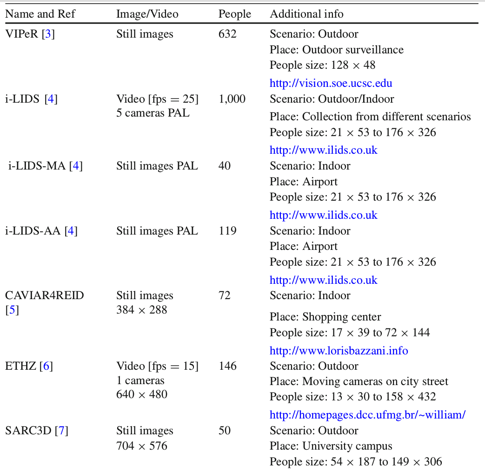
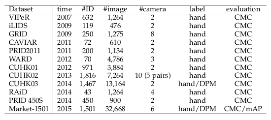

<!-- $theme: default -->

# Re-identification Overview
陈伟航

---
# 目标
  - 在视频数据中找到人物（稀疏）
  - 关联大量不同摄像头捕捉到的人物
  - 自动匹配和追踪人物
  > Detect -> Track -> Retrieval
  
  通常认为的Re-id只是指Retrieval这个过程
  - Re-id当做identification任务时，目标类似聚类
  - Re-id当做recognization任务时,目标类似Ranking
---
# 数据
  - video-based
  - image-based
  - 个体的动作行为
  - 长期的活动模式
---

---

---

# 特点与困难
- 数据
  - 摄像头采集到的图像数据的视角，环境，时间等都不同
  - 摄像头中出现的不同的人会相互干扰
  - 一个人会出现在不同的摄像头中
  - 摄像距离不确定，人数不确定
  - 训练数据与真实环境不一致，搜索空间大小不确定
---
# Detect
  - object detection圈出人物的精度不能完全满足re-id的需求
  - 人工识别代价高，不准确，经验不可迁移，需要自动re-id
---
# Feature
  - 人脸识别和图像细节不可靠，太模糊
  - 一般基于视觉特征，如衣着，持有物，但这些特征辨识度很低，且很容易受光线视角影响，而且在衣着变化大的场合直接失效
  - 特征表达很受摄像头影响
  - 特征类内差异大于类间差异：同一个人在不同地方的样子的差异大于不同人的差异
---
# 建模和系统设计
  - 类间差异有时候小于类内差异
  - 样本少，因此往往不当多分类问题来做，而当做二分类问题做，给定一个人，判断是不是同一个人
  - 需要数据标记，因此需要少的训练数据的算法往往更受青睐
  - 不同摄像头间泛化能力弱
  - 性能
  - 长时间的re-id，人物可能换衣服，拿不同的东西，短时的特征会变得不可靠

---

#  评价标准：
Rank-1 accuracy：匹配百分比，CMC curve：匹配的出现在rank的前x的百分比

---

# 研究热点
  - 寻找受环境影响少的feature representation
  - ML优化Re-id模型
---

# 步骤
  - 输入轨迹或包含行人的矩形（可能由视频监控系统生成）
  - 提取图像特征，而不仅是像素点
  - 构建一个可视化的feature representation，比如feature的柱状图
  - 比较特征的相似度来匹配人物
  - 匹配策略可能影响特征和超参数
---
# 特征表达
  
  > 提取颜色，纹理，空间结构，容易可靠测量，不同人不同摄像头间这些特征都有一些区分度
  
  - 通常结合多种视觉特征，做成特征直方图，给不同特征加权重，但特征越多越可能出现图像匹配出错
  - re-id首先要行人检测，但行人检测的准确度不太能满足re-id的需求，如果没把行人圈出来，re-id的特征提取很容易受背景影响，所以很多工作会先尝试把行人抠出来
  - 检测不同肢体部位来判断姿态，利用对称特点；
    - 将行人图像分解成多个身体部位，比较不同部位之间的相似度
  - 捕捉人物身体3D特征，减小对衣着的依赖
  - 拥挤场所精确行人检测很困难，捕捉行人之间的关系，re-id一群人
  - `从视觉特征中提取语义用于re-id，比如发型，衣服风格`
---
# 建模学习
  - 在相关的摄像头之间做迁移，亮度迁移，姿态迁移，背景迁移等
  - 距离测量:找到一个量度差异的量，使得类中距离小，类外距离大：最近邻，信息理论，逻辑精度，概率相关，RankSVM
    - Match：最近邻算法，support vector ranking，需要找距离的尺度，比如几何距离等，然后调优
  - 减少数据标记需求：半监督稀疏标记，迁移学习
  - 把re-id当做推断问题来做，填充稀疏数据；条件随机场；
  - 上下文：合并同一轨迹上的多个帧，集合分析， 考虑外部上下文比如人群，学习摄像机网络的拓扑， 减少匹配搜索空间减少出错率。
---
# 实验环境与真实环境
  - 当前数据集的局限
  - 实际搜索空间巨大，会产生许多误判，需要结合环境中其他知识来筛选，或者摄像头拓扑推断人物出现在某一帧的可能性：同一个人在不同摄像头出现的时间表达了摄像头之间的距离，寻找人群活动模式的时空关系，
  - `人群re-id`
  - 基于服饰属性的特征描述
  - 工程上应用re-id成果的比较少，关注：相关性，容量，可用性。使用GPU，结合轨迹
---
# New Idea
  - 多模态：结合红外信号，或者其他人的能量信号：运动时，能量的转移和消耗因人而异；利用声音信号
  - Deep learning
---
# 启发
- Data label：根据视频与WiFi对应关系，自动生成标记的图像数据
  - 捕捉人物准确度
  - Multi-shot
- Stage-based
  - 视频图像数据提取特征（CNN）
  - 特征聚类
  - 用WiFi数据做filter
  - 根据历史WiFi数据，为特征赋予一个权重
